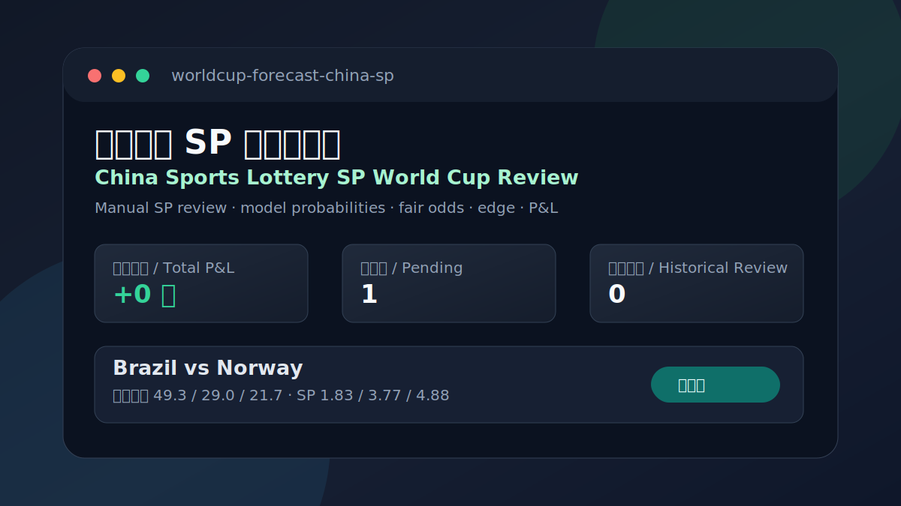

# 中国体彩 SP 世界杯复盘 / China Sports Lottery SP World Cup Review

[Live Demo / 实时网页](https://greenhand011.github.io/worldcup-forecast-china-sp/) |
[Source / 源码](https://github.com/greenhand011/worldcup-forecast-china-sp)



## 项目简介 / Overview

这是基于 `playmobil/worldcup-forecast` 改造的本地复盘项目。原模型负责预测 90 分钟胜/平/负概率；中国体彩竞彩足球胜平负 SP 由用户手动录入，只用于赛前比较、edge 计算和赛后复盘，不作为模型输入。

This project extends `playmobil/worldcup-forecast` with a China Sports Lottery SP review page. The model estimates 90-minute home/draw/away probabilities, while China Sports Lottery SP values are manually entered and used only for review and expected value analysis, not as model inputs.

当前版本把 2026 世界杯 104 场赛事做成手工录入模板：72 场小组赛、16 场 1/16 决赛（32 强）、8 场 1/8 决赛、4 场 1/4 决赛、2 场半决赛、三四名决赛和决赛。淘汰赛对阵未确定时用 `TBD` 标记。

The current version provides a 104-match 2026 World Cup template: 72 group-stage matches, 16 round-of-32 matches, 8 round-of-16 matches, 4 quarterfinals, 2 semifinals, the third-place match, and the final. Unknown knockout matchups are marked as `TBD`.

## 功能 / Features

- 读取手动录入或公开页面导入的中国体彩胜平负 SP CSV。 / Read manually entered or publicly imported China Sports Lottery 1X2 SP values from CSV.
- 计算模型概率、公允赔率、edge、模拟买入和盈亏。 / Calculate model probabilities, fair odds, edge, simulated stake, and P&L.
- 生成浅色双列卡片布局的静态 HTML 复盘页面。 / Generate a static light two-column card review page.
- 支持 GitHub Pages 在线展示。 / Support online publishing through GitHub Pages.
- 不包含自动下注、自动登录、购买彩票或绕过网站限制的功能。 / No automated betting, login, lottery purchase, or bypassing website restrictions.

## 亏损原因与修正 / Loss Diagnosis And Fix

旧页面中的亏损来自演示 SP 和演示赛果，并不是真实中国体彩数据；同时旧策略会在每场比赛强制模拟买入 100 元，即使三项 edge 都不为正。这样的结果只能说明 demo 数据和策略层有偏差，不能用于反向调参。

The old page loss came from demo SP values and demo results, not official China Sports Lottery data. It also forced a simulated 100-yuan stake on every match even when no positive edge existed. That is a strategy-layer issue, not evidence for refitting the model.

当前修正：

- `data/china_sp_review.csv` 默认 SP 和赛果留空，明确只是手工录入模板，不再伪装成真实体彩数据。
- 每场最多模拟 100 元。
- 只有用户录入完整 SP 且最大 edge 大于 `--min-edge` 时，才把 100 元模拟放到 edge 最大的一项；CLI 默认阈值为 3%。
- SP 缺失、对阵未定或没有正 edge 时，页面显示“待录入SP / 对阵待定 / 观望”，不产生亏损。
- 不使用少量历史/demo 结果调模型参数，避免过拟合。

Current fix:

- `data/china_sp_review.csv` is a manual-entry template with blank SP and blank results by default.
- Each match uses at most one simulated 100-yuan review stake.
- A stake is simulated only when complete SP values are entered and the best edge is above `--min-edge`; the CLI default threshold is 3%.
- Missing SP, unresolved matchups, or non-positive edge are shown as waiting/observing and do not create P&L.
- The model is not tuned on a tiny demo history, which helps avoid overfitting.

## 快速开始 / Quick Start

Windows PowerShell:

```powershell
python -m venv .venv
.\.venv\Scripts\Activate.ps1
python -m pip install -e .
wcforecast china-sp-review
start docs\china-sp-review.html
```

macOS / Linux:

```bash
python3 -m venv .venv
source .venv/bin/activate
python -m pip install -e .
wcforecast china-sp-review
open docs/china-sp-review.html
```

导入公开 SP 展示数据 / Import public SP display data:

```bash
wcforecast china-sp-fetch
wcforecast china-sp-review
```

`china-sp-fetch` 当前读取公开可访问的竞彩足球胜平负展示页，只导入 `nspf` 不让球胜平负三项 SP，并过滤世界杯比赛。它不会登录、不会下单、不会购买彩票；抓取到的 SP 仍建议按官方渠道复核。

`china-sp-fetch` reads publicly accessible 1X2 SP display data, imports only non-handicap `nspf` home/draw/away SP rows, and filters World Cup matches. It does not log in, place bets, or purchase lottery tickets; fetched SP values should still be checked against official channels.

页面展示逻辑 / Page sections:

- `未来预测`: 已有 SP、尚未到比赛日或尚未开赛的比赛。 / Upcoming matches with SP.
- `待赛果复核`: 已到比赛日、已有赛前 SP，但 `actual` 还没填的比赛。 / Matches with SP that need final H/D/A confirmation.
- `历史复盘`: `actual = H/D/A` 后自动结算盈亏。 / Settled review after `actual = H/D/A`.
- 页面队名使用中文展示，模型内部仍使用英文队名识别。 / Team names are displayed in Chinese while the model still uses English identifiers internally.

## CSV 数据格式 / CSV Format

编辑 `data/china_sp_review.csv`，每行一场比赛。以 `#` 开头的行是注释，会被程序忽略。

Edit `data/china_sp_review.csv`, one match per row. Lines starting with `#` are ignored.

```csv
date,stage,home,away,neutral,sp_home,sp_draw,sp_away,actual
TBD,小组赛 A组 第1轮,Mexico,South Africa,false,,,,
TBD,1/8决赛 第1场,TBD,TBD,true,,,,
```

字段说明 / Fields:

- `date`: 比赛日期；未确认可写 `TBD`。 / Match date; use `TBD` if not confirmed.
- `stage`: 赛段，例如 `小组赛 A组 第1轮`、`1/8决赛 第1场`、`决赛`。 / Stage label for display only.
- `home`: 项目识别的英文主队名；未定写 `TBD`。 / Home team recognized by the project; use `TBD` if unresolved.
- `away`: 项目识别的英文客队名；未定写 `TBD`。 / Away team recognized by the project; use `TBD` if unresolved.
- `neutral`: `true` 或 `false`；主办国主场场次可设为 `false`。 / Whether the match is neutral.
- `sp_home`: 中国体彩主胜 SP。 / China Sports Lottery home-win SP.
- `sp_draw`: 中国体彩平局 SP。 / China Sports Lottery draw SP.
- `sp_away`: 中国体彩主负/客胜 SP。 / China Sports Lottery away-win SP.
- `actual`: `H` / `D` / `A`；未开奖留空。 / Final 90-minute result; leave blank before settlement.

`actual = H/D/A`: `H = home win`, `D = draw`, `A = away win`.

## 方法说明 / Method

复盘使用原项目已有的赛前独立模型：冻结的 FIFA 快照、Transfermarkt 阵容身价、无泄漏 Elo，以及 Klement 风格结构先验（GDP、人口、气候、主场优势、足球文化）。市场赔率和中国体彩 SP 只用于预测后的比较和复盘，绝不作为模型输入。

The review uses the original market-independent pre-match model: frozen FIFA snapshot, Transfermarkt squad values, no-leakage Elo, and Klement-style structural priors such as GDP, population, climate, home advantage, and football culture. Market odds and China Sports Lottery SP are used only after prediction for comparison and review, never as model inputs.

```text
fair_odds = 1 / probability
edge = probability * SP - 1
pnl = stake_on_actual * sp_actual - total_stake
```

默认命令每场最多模拟 `100` 元，最小单位 `100` 元，并要求至少 3% 正 edge：

```bash
wcforecast china-sp-review --bankroll 100 --unit 100 --min-edge 0.03
```

The default command uses at most one simulated `100` yuan stake per match and requires at least 3% positive edge:

```bash
wcforecast china-sp-review --bankroll 100 --unit 100 --min-edge 0.03
```

## 网页 / Pages

本地打开：

```text
docs/china-sp-review.html
```

GitHub Pages:

[https://greenhand011.github.io/worldcup-forecast-china-sp/](https://greenhand011.github.io/worldcup-forecast-china-sp/)

## 免责声明 / Disclaimer

本项目仅用于模型学习、复盘和数据分析，不构成投注建议。中国体彩 SP 需要用户从合法渠道手动录入。模型概率不是保证，历史盈亏不能证明长期存在 edge。请遵守所在地法律法规，理性对待风险。

This project is for model learning, review, and data analysis only. It is not betting advice. China Sports Lottery SP values must be entered manually from legal sources. Model probabilities are not guarantees, and historical P&L does not prove a persistent edge. Please follow local laws and regulations and treat risk responsibly.

## 致谢 / Credits

本项目基于 `playmobil/worldcup-forecast` 的结构化 + 贝叶斯世界杯预测模型进行改造。原模型逻辑、训练流程和市场独立性原则保持不变；本仓库新增的是中国体彩 SP 手动复盘展示层。

This project is adapted from the structural + Bayesian World Cup forecaster in `playmobil/worldcup-forecast`. The original model logic, training flow, and market-independence principle are preserved; this repository adds a manual China Sports Lottery SP review layer.
